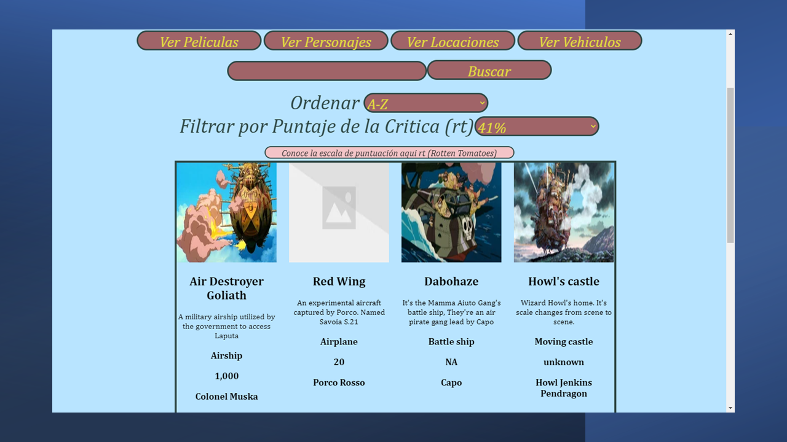

# Data Lovers

## Índice

* [1. Preámbulo](#1-preámbulo)
* [2. Resumen del proyecto](#2-resumen-del-proyecto)
* [3. Consideraciones generales](#3-consideraciones-generales)
* [4. Consideraciones específicas](#4-consideraciones-específicas)
* [5. Consideraciones técnicas](#5-consideraciones-técnicas)
* [6. Desarrollo del proyecto](#6-desarrollo-del-proyecto)
* [7. Material utilizado](#7-material-utilizado)

***

## 1. Preámbulo

Nuestro segundo proyecto en bootcamp de Laboratoria DEV007, consiste en 
procesar información de un tema especifico, manipularla y entregarla a 
traves de una web amigable al usuario.
Este proyecto se inclino hacia la data entregada sobre Studio Ghibli.

* [Studio Ghibli](src/data/ghibli/ghibli.json).
  En este set encontrarás una lista de las animaciones y sus personajes del
  [Studio Ghibli](https://ghiblicollection.com/).
  - [Investigación con seguidores de las animaciones del Studio Ghibli](src/data/ghibli/README.md)

## 2. Resumen del proyecto

Construiremos una pagina web, donde visualizaremos un conjunto de datos
que se adecuaran a las necesidades de nuestros usuarios.
Para llegar a esta información realizaremos encuestas para entender que
datos desean que sean entregados.

## 3. Consideraciones generales

Para este proyecto se consideraron y utilizaron tres puntos importantes:

**1. Historias de Usuarios:** Se realizaron encuestas en instagram, un 
formulario de preguntas y los hallazgos entregados por Laboratoria.
De esta información se decidieron principales puntos a tratar en la web:

* Descripcion de las peliculas. 
* Donde se pueden ver las peliculas.
* Nombre de las peliculas.
* Nombre de los personajes.
* Información de las animaciones (fechas estrenos, score, productor, etc.)
* Poder filtrar y ordenar la información.

    * Detalle Instagram

    

    * Detalle Formulario

    

    * Detalle Laboratoria

    

**2. Trello:** Es una herramienta de organización, que permitio desglosar
cada una de las actividades a realizar por sprint.

*   
    
**3. Prototipos baja y alta fidelidad.** Hubo diseño a mano del prototipo
de baja fidelidad, y posterior el de alta fidelidad que fue diseñado en figma.

* [linkfigma](https://www.figma.com/file/gLHnwK4qIEO4H9YWCgRxn9/Data-Gibli?type=design&node-id=5-4&t=hyTHuHIXtT1GA8Np-0)

*   

## 4. Consideraciones específicas

#### Testeos de usabilidad

Se probo la web con tres personas de distintas edades, se logro llegar a la web
actual considerando que fuera amigable en su uso y tambien util tanto para el
que ya conoce al studio como tambien a quien no sabia de Ghibli.

### Pruebas unitarias

El _boilerplate_ de este proyecto no incluyen Pruebas Unitarias (_tests_), así es
que se debieron escribir para las funciones encargadas de  _procesar_,
_filtrar_ y _ordenar_ la data, así como _calcular_ estadísticas.

Como minimo deben considerar dar una cobertura del 70% de _statements_
(_sentencias_), _functions_ (_funciones_), _lines_ (_líneas_), y _branches_
(_ramas_) del archivo `src/data.js` que contenga las funciones.


## 5. Consideraciones técnicas

La lógica del proyecto debe estar implementada completamente en JavaScript
(ES6), HTML y CSS. En este proyecto NO está permitido usar librerías o
frameworks, solo [vanilla JavaScript](https://medium.com/laboratoria-how-to/vanillajs-vs-jquery-31e623bbd46e).

El _boilerplate_ contiene una estructura de archivos como punto de partida así
como toda la configuración de dependencias:

```text
.
├── EXTRA.md
├── README.md
├── package.json
├── src
|  ├── data (según con qué data trabajes)
|  |  ├── lol
|  |  |  ├── lol.js
|  |  |  ├── lol.json
|  |  |  └── README.md
|  |  ├── pokemon
|  |  |  ├── pokemon.js
|  |  |  ├── pokemon.json
|  |  |  └── README.md
|  |  └── rickandmorty
|  |  |  ├── rickandmorty.js
|  |  |  ├── rickandmorty.json
|  |  |  └── README.md
|  |  └── athletes
|  |  |  ├── athletes.js
|  |  |  ├── athletes.json
|  |  |  └── README.md
|  |  └── ghibli
|  |  |  ├── ghibli.js
|  |  |  ├── ghibli.json
|  |  |  └── README.md
|  ├── data.js
|  ├── index.html
|  ├── main.js
|  └── style.css
└── test
   └── data.spec.js

directory: 7 file: 20
```

### `src/index.html`

Como en el proyecto anterior, existe un archivo `index.html`. 
Acá va la página que se mostrará al usuario. También nos sirve para indicar
qué scripts se usarán y unir todo lo que hemos hecho.

### `src/main.js`

Recomendamos usar `src/main.js` para todo el código que tenga que ver con
mostrar los datos en la pantalla. Con esto nos referimos básicamente a la
interacción con el DOM. Operaciones como creación de nodos, registro de
manejadores de eventos (_event listeners_ o _event handlers_), ....

El corazón de este proyecto es la manipulación de datos a través de arreglos
y objetos.

Este archivo debe contener toda la funcionalidad que corresponda
a obtener, procesar y manipular datos (tus funciones). Por ejemplo:

* `filterData(data, condition)`: esta función `filter` o filtrar recibiría la
  data, y nos retornaría aquellos datos que sí cumplan con la condición.

* `sortData(data, sortBy, sortOrder)`: esta función `sort` u ordenar
  recibe tres parámetros.
  El primer parámetro, `data`, nos entrega los datos.
  El segundo parámetro, `sortBy`, nos dice con respecto a cuál de los campos de
  la data se quiere ordenar.
  El tercer parámetro, `sortOrder`, indica si se quiere ordenar de manera
  ascendente o descendente.

* `computeStats(data)`: la función `compute` o calcular, nos permitirá hacer
  cálculos estadísticos básicos para ser mostrados de acuerdo a la data
  proporcionada.

### `src/data`

En esta carpeta están los datos de las diferentes fuentes. Encontrarás una
carpeta por cada fuente, y dentro de cada carpeta dos archivos: uno con la
extensión `.js` y otro `.json`. Ambos archivos contienen la misma data; la
diferencia es que el `.js` lo usaremos a través de una etiqueta `<script>`,
mientras que el `.json` está ahí para opcionalmente cargar la data de forma
asíncrona con [`fetch()`](https://developer.mozilla.org/es/docs/Web/API/Fetch_API)
(ver sección de [_Parte Opcional_](#6-hacker-edition)).

### `test/data.spec.js`

Tendrás también que completar las pruebas unitarias de las funciones
implementadas en el archivo `data.js`.

## 6. Desarrollo del proyecto

**1. Pagina de inicio:** Se considero paleta de colores de studio Ghibli con 
botones que sean bien distinguidos en su funcionalidad, que no aparezcan 
imagenes hasta que el usuario pueda elegir que quiere averiguar.

   * 

**2. Botones Filtrados:** Desde un inicio se considero dar la opcion de la 
data ya filtrada por temas considerados relevantes, como: peliculas, personajes,
locaciones y vehiculos. Con sus respectivos botones de acceso.

   * 

**3. Filtro Peliculas:** Puedes acceder a todas las peliculas que tenemos
en la data.

   * 

**4. Filtro Personajes:** Puedes acceder a todos los personajes que tenemos
en la data.

   * 

**5. Filtro Locaciones:** Puedes acceder a todas las locaciones que tenemos
en la data.

   * 

**6. Filtro Vehiculos:** Puedes acceder a todos los vehiculos que tenemos
en la data.

   * 

**7. Barra de busqueda:** Puedes acceder a las peliculas solo escribiendo
una letra y te apareceran todas las que coincidan.

   * 

**8. Ordenar A-Z y Z-A:** Puedes ordenar las peliculas de la A a la Z y
viceversa.

   * 
   * 

**9. Links en la web:** Nuestra web tambien te guia hacia mas lugares
donde puedes obtener información de Studio Ghibli. Tenemos links de 
Instagram, Facebook, Tik Tok, Pagina oficial de Ghibli, Wikipedia del
Studio y link donde muestra tabla de puntajes para Score de pelilculas.

   * 

**10. Filtrar por puntaje:** Se realizaron encuestas en instagram, un 
formulario de preguntas y los hallazgos entregados por Laboratoria.
De esta información se decidieron principales puntos a tratar en la web:

   * 
   * 

<!-- **10. Test:** Se realizaron test a la web para optimizar su funcionamiento.
Estos arrojaron 100% de aceptación.

   * 
    -->
## 7. Material utilizado

### Contenido de referencia

#### Diseño de experiencia de usuario (User Experience Design)

* Investigación con usuarios / entrevistas
* Principios de diseño visual

#### Desarrollo Front-end

* Unidad de testing en curso de JavaScript en LMS.
* Unidad de arreglos en curso de JavaScript en LMS.
* Unidad de objetos en curso de JavaScript en LMS.
* Unidad de funciones en curso de JavaScript en LMS.
* Unidad de DOM en curso de Browser JavaScript en LMS.
* [Array en MDN](https://developer.mozilla.org/es/docs/Web/JavaScript/Referencia/Objetos_globales/Array)
* [Array.sort en MDN](https://developer.mozilla.org/es/docs/Web/JavaScript/Referencia/Objetos_globales/Array/sort)
* [Array.map en MDN](https://developer.mozilla.org/es/docs/Web/JavaScript/Referencia/Objetos_globales/Array/map)
* [Array.filter en MDN](https://developer.mozilla.org/es/docs/Web/JavaScript/Referencia/Objetos_globales/Array/filter)
* [Array.reduce en MDN](https://developer.mozilla.org/es/docs/Web/JavaScript/Referencia/Objetos_globales/Array/reduce)
* [Array.forEach en MDN](https://developer.mozilla.org/es/docs/Web/JavaScript/Referencia/Objetos_globales/Array/forEach)
* [Object.keys en MDN](https://developer.mozilla.org/es/docs/Web/JavaScript/Referencia/Objetos_globales/Object/keys)
* [Object.entries en MDN](https://developer.mozilla.org/es/docs/Web/JavaScript/Referencia/Objetos_globales/Object/entries)
* [Fetch API en MDN](https://developer.mozilla.org/en-US/docs/Web/API/Fetch_API)
* [json.org](https://json.org/json-es.html)
* [expressions-vs-statements](https://2ality.com/2012/09/expressions-vs-statements.html)
* [expresión vs sentencia](https://openclassrooms.com/en/courses/4309531-descubre-las-funciones-en-javascript/5108986-diferencia-entre-expresion-y-sentencia)
* [datos atómicos vs datos estructurados](https://www.todojs.com/tipos-datos-javascript-es6/)
* [Modulos: Export](https://developer.mozilla.org/es/docs/Web/JavaScript/Referencia/Sentencias/export)
* [Modulos: Import](https://developer.mozilla.org/es/docs/Web/JavaScript/Referencia/Sentencias/import)

#### Herramientas

* [Git](https://git-scm.com/)
* [GitHub](https://github.com/)
* [GitHub Pages](https://pages.github.com/)
* [Node.js](https://nodejs.org/)
* [Jest](https://jestjs.io/)

#### Organización del Trabajo

* [Historias de Usuario](https://www.youtube.com/watch?v=ky6wFiF5vMk&t=344s).
* [Cómo dividir H.U.](https://www.youtube.com/watch?v=Ueq786iZ30I&t=341s)
* [Guía para Data Lovers](https://docs.google.com/presentation/d/e/2PACX-1vQhx9D36NjpH-Daea-ITPUDUzNL8ZiNAprq_7b5PSUrfutk45tEtaOLz2lmd8f54_5jX1hypDM8f8SM/pub?start=false&loop=false&delayms=60000)
